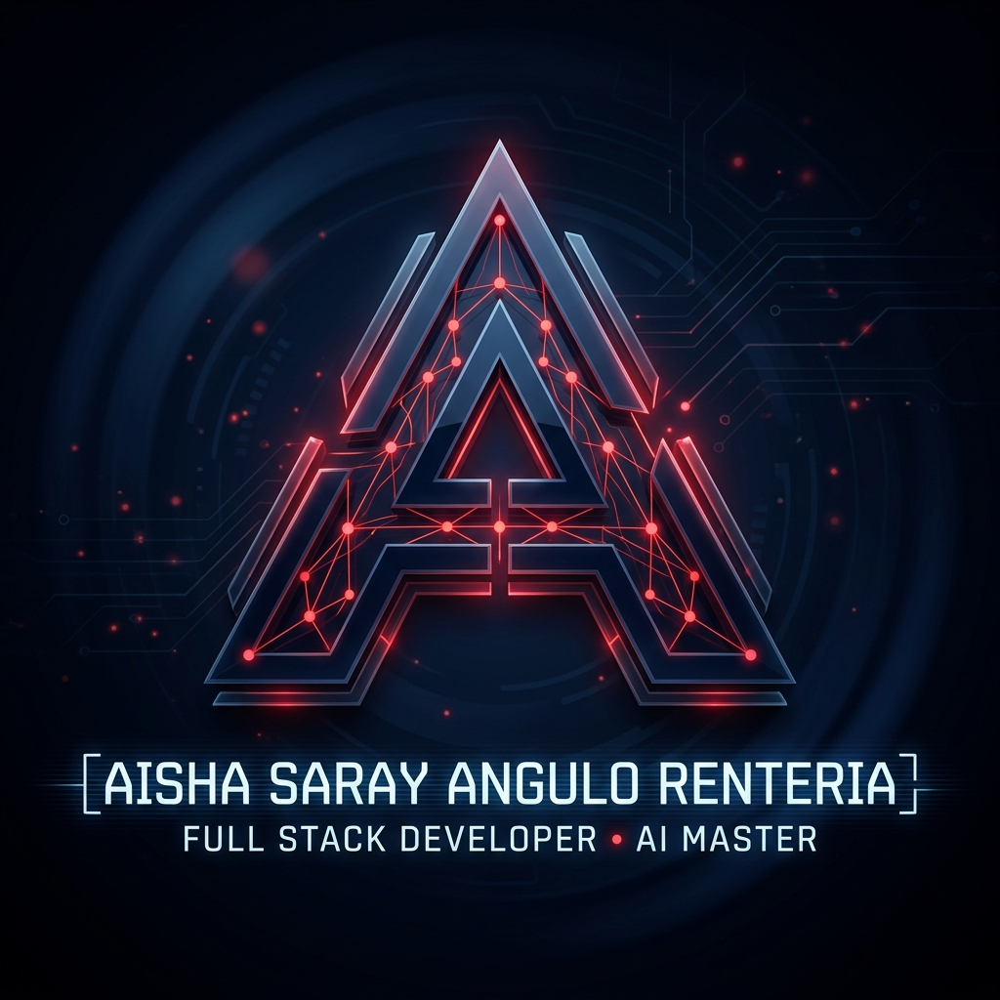

<div align="center">

  <!-- LOGO OFICIAL CON EL NOMBRE EXACTO DE TU ARCHIVO -->
  

  # [ AISHA SARAY ANGULO RENTERIA ]
  ### ⚡ FULL STACK WEB DEVELOPER • AI MASTER 🧠

  *Transformando código en inteligencia artificial y aplicaciones web de alto impacto.*

  [](https://github.com/aisharenterria-ai)
  [](https://linkedin.com)

</div>

---

## 👩‍💻 Sobre Mí | About Me

```javascript
const aisha = {
  name: "Aisha Saray Angulo Renteria",
  role: "Full Stack Web Developer & Artificial Intelligence Master",
  github: "aisharenterria-ai",
  passions: ["Web Architecture", "Deep Learning", "Neural Networks", "UX/UI Design"],
  currentFocus: "Desarrollando soluciones web inteligentes y escalables 🚀"
};
